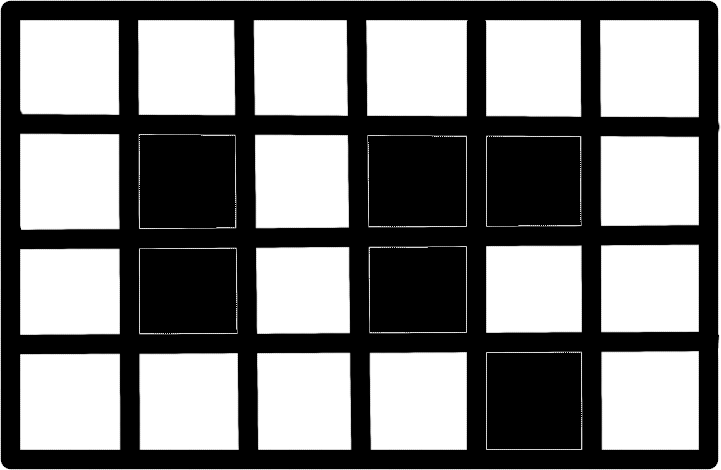

* Our library is header-only. It implements algorithms as functions.
* We have Converter struct for users don't have to think about graph representation. Any supported representation will work fine. All algorithms except for Lee's take Converter class as an argument and extract the graph from it. The user only have to pass Converter(graph) as an argument. 
* Converter class constructs adjacency list from any graph and saves it as data member. 
* All of our algorithms use adjacency list representation.
* Lee's algorithm takes bool matrices instead of graph. These matrices represent mazes like these:

* If a user has edge list representation we require for him to make it using our Edge struct which is:
    
* We conduct all experiments in env.cpp which is a different target in our build.File structure:
./
  ├── Architecture.md
  ├── CMakeLists.txt
  ├── Control_and_acceptance_procedure.md
  ├── LICENSE
  ├── README.md
  ├── Requirements.md
  ├── build_repo_structure.sh
  ├── include/
  ├──   ├── spath.hpp
  ├── maze.png
  ├── tests/
  ├──   ├── bench.cpp
  ├──   ├── tests.cpp
  ├── utility/
  ├──   ├── Architecture-template.md
  ├──   ├── build_repo_structure.sh
